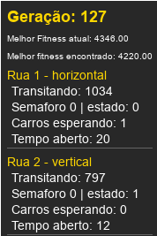

# Algoritmos Evolutivos Aplicados para Otimização de Semáforos 🚦💻  

### Projeto da disciplina SSC-0713 - Sistemas Evolutivos Aplicados à Robótica

---

[**Estrutura do Projeto**](#estrutura-do-projeto-) · [**Instalação**](#instalação-) · [**Uso e Simulação**](#uso-e-simulação-) · [**Algoritmo Evolutivo**](#algoritmo-evolutivo-) · [**Resultados**](#resultados-) · [**Contribuição**](#contribuição-) · [**Licença**](#licença-) · [**Alunos**](#alunos-)

---

<p align="center">
  
</p>


<p align="center">
Este projeto explora a aplicação de <strong>algoritmos evolutivos</strong> para otimizar o <strong>tempo de abertura e fechamento de semáforos</strong> em um ambiente de simulação. Utilizando técnicas como <strong>seleção por torneio</strong>, <strong>crossover</strong> e <strong>mutação adaptativa</strong>, o sistema busca <strong>minimizar o tempo de espera</strong> dos veículos e <strong>melhorar o fluxo do trânsito</strong>.
</p>

<p align="center">
Durante a execução, o projeto apresenta métricas detalhadas na barra lateral e gráficos que mostram a evolução do <strong>fitness</strong> ao longo das gerações. As próximas seções detalham a estrutura do projeto, seu funcionamento e os resultados obtidos.
</p>

---


## Estrutura do Projeto 🔗
- **`main.py`**: Arquivo principal que executa a simulação gráfica.
- **`AlgotimoGenetico.py`**: Implementação do algoritmo evolutivo com seleção, crossover e mutação.
- **`carro.py`**: Modelo dos carros que transitam nas ruas.
- **`individuo.py`**: Definição dos indivíduos que representam os mapas e os semáforos.
- **`interconexoes.py`**: Responsável por gerenciar as interconexões e semáforos.
- **`estatisticas.py`**: Cálculo e visualização de estatísticas durante a execução.
- **`config.py`**: Parâmetros de configuração.

---

## Instalação 💻  

### Requisitos:
- **Python 3.8 ou superior**  
- **Bibliotecas**:  
   - `pygame`  
   - `matplotlib`  
- **Gerenciador de pacotes**: `pip` ou **conda** (recomendado)

### Passos:
1. Clone o repositório:  
  ```bash
   git clone https://github.com/GotemBarbosa/Genetic-traffic-light.git
   cd Genetic-traffic-light/
  ```

2. Recomenda-se utilizar um ambiente virtual para facilitar a instalação e gerenciamento das dependências. Se estiver utilizando o **conda**, crie e ative um ambiente virtual:
  ```bash
  conda create --name nome_do_ambiente python=3.9
  conda activate nome_do_ambiente
  ```

Saiba mais sobre o **conda** [aqui](https://docs.conda.io/projects/conda/en/latest/user-guide/tasks/manage-environments.html).

2. Instale as dependências:
  ```bash
  pip install pygame matplotlib
  ```

3. Execute o projeto:
  ```bash
  python main.py
  ```

---
## Uso e Simulação ▶️

### Teclas de Atalho
Durante a simulação, utilize as seguintes teclas para controlar a execução:
- **`F`**: Aumenta a velocidade da simulação.
- **`S`**: Reduz a velocidade da simulação.
- **`ESPACO`**: Ativa o modo rápido, acelerando os eventos.
- **`P`**: Pausa a simulação.


### Como Funciona a Simulação
A simulação consiste na visualização de um sistema de ruas e semáforos, onde carros trafegam de forma otimizada com base nos algoritmos evolutivos. Ela apresenta métricas em tempo real, organizadas conforme descrito abaixo:

#### Barra Lateral (Métricas)
Na lateral da tela, são exibidas métricas importantes para monitorar a simulação:
- **Geração Atual**: Número da geração do algoritmo evolutivo em execução.
- **Melhor Fitness Atual**: O fitness do melhor indivíduo da geração atual.
- **Melhor Fitness Geral**: O menor fitness encontrado em todas as gerações (valor ideal a ser minimizado).
- **Carros Transitando**: Número de carros em movimento em cada rua.
- **Carros Esperando**: Número de carros parados em cada semáforo.
- **Tempo Aberto dos Semáforos**: O tempo em que cada semáforo permanece aberto antes de mudar de estado.

<p align="center">
  
</p>


#### Gráfico de Fitness
Um gráfico é gerado ao longo da simulação, apresentando a evolução do **fitness** das gerações. Esse gráfico ajuda a visualizar a eficiência dos indivíduos otimizados:
- **Eixo X**: Representa o número da geração.
- **Eixo Y**: Representa o valor do fitness (quanto menor, melhor).

---
## Algoritmo Evolutivo 📌  

### **1. Indivíduos na População**  
   - Cada indivíduo é representado por um vetor de **configuração dos semáforos** presentes nas ruas.
   - Um indivíduo é composto por vetores de:  
     - **Tempo de troca**: O período em que cada semáforo permanece aberto antes de mudar.  
     - **Estado inicial**: Define o estado inicial (aberto ou fechado) dos semáforos no início da simulação.
   - Cada par desses parâmetros representa um semáforo no mapa e cada indivíduo tem uma configuração para todos os semáforos.
   - Ambos os parâmetros do indivíduo são otimizados, de forma a garantir, durante a evolução, que os semáforos encontrem um **tempo de abertura e fechamento que minimiza a espera dos veículos**, bem como o **estado inicial que garante a sincronia com outros semáforos** de uma mesma intersecção.


### **2. Fitness (Avaliação dos Indivíduos)**  
   - O **fitness** mede a qualidade de um indivíduo com base nos seguintes critérios:
     - **Tempo acumulado de espera** dos veículos.  
     - **Penalização** para situações em que dois semáforos do mesmo cruzamento estão abertos simultaneamente.  
     - **Penalização** para semáforos com tempos de troca muito curtos.  
   - O fitness é uma **função a ser minimizada** – quanto menor o valor, melhor o indivíduo.


### **3. Seleção dos Melhores Indivíduos**  
  - **Elitismo**: Os melhores indivíduos (elites) de cada geração são preservados diretamente na próxima geração.
   - A seleção para o cruzamento é realizada por meio do método **torneio**:  
     - Um grupo de indivíduos é selecionado aleatoriamente.  
     - O indivíduo com o melhor fitness dentro desse grupo é escolhido.  

### **4. Cruzamento (Crossover)**  
   - O cruzamento é feito utilizando o método **crossover de um ponto**:  
     - Um ponto de corte é escolhido aleatoriamente no vetor do indivíduo.  
     - Os genes antes do ponto vêm de um dos pais, e os genes após o ponto vêm do outro.  
   - Esse processo gera dois novos indivíduos (filhos), que carregam características de ambos os pais.


### **5. Mutação**  
   - Após o cruzamento, os indivíduos sofrem **mutação** com uma probabilidade definida:  
     - Pequenas alterações são feitas no **tempo de troca** dos semáforos.  
     - O **estado inicial** dos semáforos também pode ser alterado.  
   - A mutação é **adaptativa**: sua probabilidade diminui conforme o número de gerações aumenta.


### **6. Composição das Novas Populações**  
   - A nova geração é formada por:  
     - **Elites**: Indivíduos de melhor fitness da geração anterior.  
     - **Filhos gerados** por cruzamento e mutação dos indivíduos selecionados.  
   - O processo continua até que a população atinja o tamanho definido para ela.

---

## Resultados 📊  
### Gráfico de Fitness:
Durante a execução, um gráfico interativo é exibido, mostrando a evolução do **fitness** ao longo das gerações.


Por meio deste gráfico, é possível analisar, ao longo das gerações, a minimização do valor do fitness do melhor indivíduo. É valido ressaltar ainda que a **geração dos veículos** que transitam pelas ruas é **realizada de forma aleatória**, fazendo com que **o melhor indivíduo de uma dada geração não necessariamente seja o melhor indivíduo da próxima geração**.

---

### Conclusões:

1. **Estabilização do Fitness**  
   - É possível notar que o valor de **fitness estabiliza** em uma determinada faixa depois de algumas gerações.  
   - Isso ocorre porque o algoritmo encontra um **mínimo local** e, a partir desse ponto, as melhorias dependem das **condições aleatórias** introduzidas pela mutação e geração de veículos.

2. **Complexidade da Independência entre Semáforos**  
   - A abordagem adotada, onde cada semáforo é tratado de forma **independente**, adiciona uma **complexidade maior** ao problema.  
   - Essa independência requer a **sincronização manual entre semáforos** de uma mesma intersecção para otimizar o fluxo de veículos.  
   - Essa característica reflete melhor a realidade, mas torna o problema mais difícil de resolver.

3. **Fator Aleatório na Simulação**  
   - A presença de **fatores aleatórios** na simulação, como a geração de veículos, adiciona variação ao problema e torna a convergência menos estável.  
   - Embora a **remoção do fator aleatório** possa estabilizar a convergência do algoritmo, isso **não representaria um cenário realista** de tráfego.

---

### Link do vídeo explicando o projeto 🎥  
[Assista aqui](https://youtu.be/oU_rY-FiDd0)
Apresentação por Gabriel Barbosa dos Santos

---

## Contribuição 🤝  
Contribuições são bem-vindas! Sinta-se à vontade para abrir **Issues** ou enviar **Pull Requests**.

---

## Licença 📄  
Este projeto está sob a licença MIT.

---

## Alunos 👨‍🎓  

| Nome Completo                | Número USP       | GitHub                           |
|------------------------------|------------------|----------------------------------|
| Felipe Carneiro Machado      | **14569373**        | [GitHub](https://github.com/FelipeCarneiroMachado) |
| Gabriel Barbosa dos Santos   | **14613991**           | [GitHub](https://github.com/GotemBarbosa) |
| Renan Parpinelli Scarpin     | **14712188**        | [GitHub](https://github.com/RenanScarpin) |
| Vinicius Neves Gustierrez    | **14749363**        | [GitHub](https://github.com/Vinicius-GN) |
